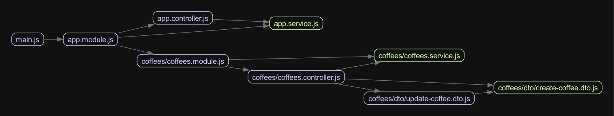

# NestJS Advanced Concepts

## CLI

- `$ NEST_DEBUG yarn start:dev`: start in debug mode

### Check Circular Dependencies and Generate Graph

#### Prerequisites

- `$ brew install graphviz`: install Graphviz to generate images

#### Commands

- `$ npx madge dist/main.js --circular`: check circular dependencies
- `$ npx madge dist/main.js --image graph.png`: create graph image

#### Result

### Make HTTP Requests with Curl

- `$ curl -H "Content-Type: application/json" localhost:3000/coffees -d "{}"`
- `$ curl -X GET -w "\nTotal: %{time_total}s\n" "localhost:3000/fibonacci?n=41"`
- `$ for i in `\``seq 1 50`\``; do curl -w "\n" "localhost:3000/coffees"; done`: 
